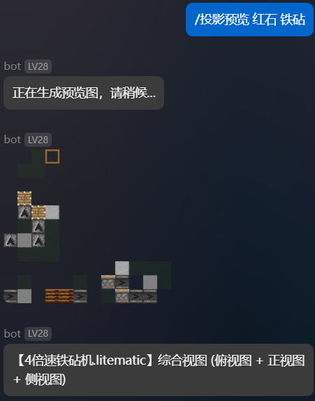
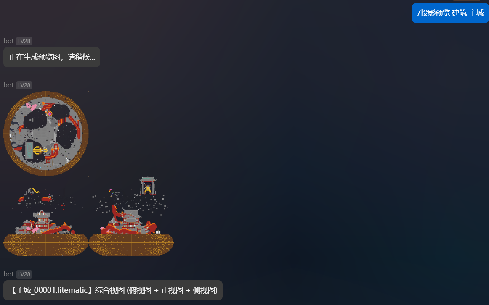
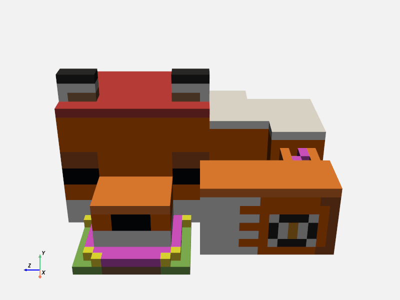

# AstrBot Litematic 插件

用于管理和共享 Minecraft `.litematic` 文件的 AstrBot 插件。

## 功能特点

- 📁 **分类管理**：按类别整理存储 litematic 文件
- 📤 **文件上传**：便捷上传 litematic 文件到指定分类
- 📋 **文件列表**：查看各分类下的所有 litematic 文件
- 📥 **文件获取**：直接获取并下载 litematic 文件
- 🗑️ **删除功能**：支持删除文件或整个分类
- 📊 **材料统计**：分析投影所需的方块材料清单
- 📝 **投影信息**：查看投影文件的详细信息
- 🖼️ **投影预览**：生成投影的2D渲染图像，支持多角度查看
- 🧊 **3D渲染**：生成投影的3D模型视图，支持旋转和缩放
- 🔘 **交互按钮**：支持按钮插件，提供更便捷的操作体验

## 使用方法

### 基本命令

- **查看帮助**：`/投影`
- **文件上传**：`/投影 分类名`
- **列出分类**：`/投影列表`
- **列出文件**：`/投影列表 分类名`
- **获取文件**：`/投影获取 分类名 文件名`
- **删除文件**：`/投影删除 分类名 文件名`
- **删除分类**：`/投影删除 分类名`
- **材料分析**：`/投影材料 分类名 文件名`
- **投影信息**：`/投影信息 分类名 文件名`
- **投影预览**：`/投影预览 分类名 文件名 [视角]`
- **3D预览**：`/投影3D 分类名 文件名`

### 文件上传步骤

1. 输入命令：`/投影 分类名`
2. 在5分钟内发送 `.litematic` 文件
3. 系统将保存文件到指定分类

### 文件获取步骤

1. 查看可用文件：`/投影列表 分类名`
2. 获取特定文件：`/投影获取 分类名 文件名`
3. 机器人将发送文件供下载

### 投影分析功能

#### 材料分析

使用 `/投影材料 分类名 文件名` 可以获得以下信息：

- 投影中所有使用的方块类型及数量
- 按数量降序排列，方便规划材料收集

#### 投影详情

使用 `/投影信息 分类名 文件名` 可以获得以下信息：

- 投影名称、作者和描述
- 投影的区域信息和尺寸

#### 投影预览

使用 `/投影预览 分类名 文件名 [视角]` 可以获得以下信息：

- 投影的2D渲染图像，默认为综合视图
- 支持的视角选项：
  - `top`：俯视图（从上向下看）
  - `front`或`north`：正视图（北面）
  - `side`或`east`：侧视图（东面）
  - `south`：南面视图
  - `west`：西面视图
  - `combined`：综合视图（俯视图+正视图+侧视图，默认选项）

#### 3D投影预览

使用 `/投影3D 分类名 文件名` 可以获得以下信息：

- 投影的3D渲染模型图像
- 支持以下交互功能：
  - 模型旋转：查看不同角度的结构
  - 缩放查看：检查细节或全局结构
  - 方块高亮：突出显示特定类型的方块
  - 截面查看：查看内部结构

### 交互按钮功能

本插件支持 AstrBot 的按钮插件，提供更便捷的操作体验：

- 当按钮插件已安装时，命令响应会显示为交互按钮
- 当按钮插件未安装时，命令响应会显示为文字信息
- "帮助"按钮始终会显示文字帮助信息，方便用户查看命令说明
- 上传文件按钮仅在查看分类文件列表时显示

## 安装说明

1. 确保已安装 AstrBot
2. 将插件文件夹 `astrbot_plugin_litematic` 复制到 AstrBot 的 `data/plugins` 目录
3. 重启 AstrBot
4. 使用 `/plugin litematic` 命令查看插件是否正确加载

## 配置说明

插件首次启动时会自动创建以下默认分类：

- 建筑
- 红石

您可以通过 `/投影 新分类名` 命令添加更多分类。

### 文件存储位置

投影文件（`.litematic`）存储在 `data/litematic/` 目录下，按分类进行组织管理。每个分类对应一个子文件夹。

## 更新日志

- v1.3.5 添加了按钮插件支持，优化了交互体验
  - 添加了按钮插件支持，提供更便捷的操作体验
  - 优化了按钮显示逻辑，根据按钮插件是否安装决定显示方式
  - 按钮功能易封，请谨慎安装使用！
  - 修改了投影文件保存路径，如果更新需要手动迁移！
- v1.3.0 添加了3D投影渲染功能
- v1.2.0 增加了方块方向的旋转
- v1.1.1 优化了main代码结构，可读性更强了
- v1.1.0 增加了较为简陋的投影图像渲染
- v1.0.0 初次提交

## TODO

- 投影非完整方块的渲染支持
- 对复杂红石零件进行适配

## 注意事项

- 仅支持 `.litematic` 格式的文件
- 上传文件大小可能受到平台限制
- 文件名支持模糊匹配，可以只输入部分文件名
- 复杂的投影文件分析可能需要更长处理时间
- 按钮功能需要安装 AstrBot 的按钮插件才能完全体验

## 作者信息

- 作者：kterna
- 版本：1.3.5
- 仓库：[https://github.com/kterna/astrbot_plugin_litematic](https://github.com/kterna/astrbot_plugin_litematic)
