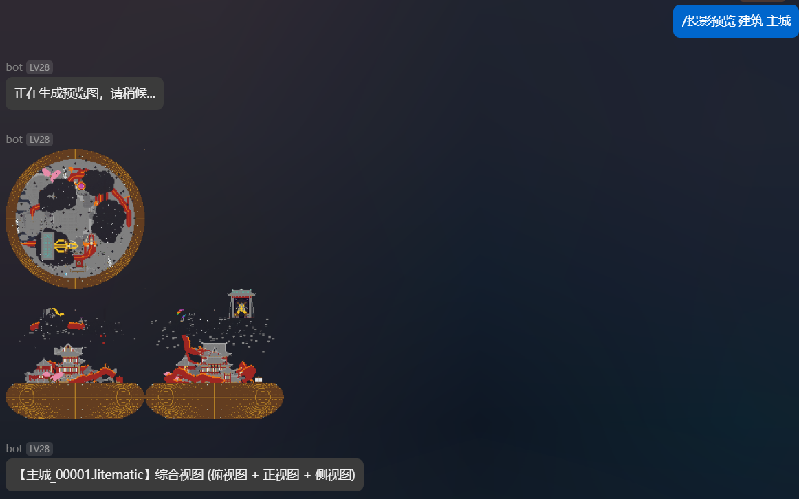
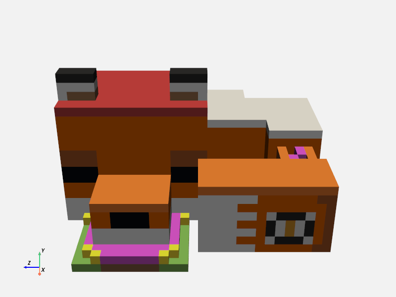
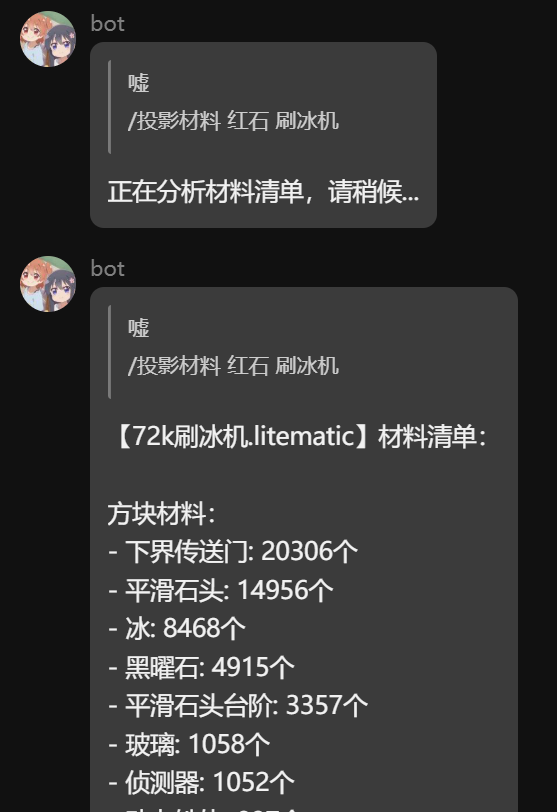

# AstrBot Litematic 插件

用于管理和共享 Minecraft `.litematic` 文件的 AstrBot 插件。

[](https://github.com/kterna/astrbot_plugin_litematic)


## 功能特点

- 📁 **分类管理**：按类别整理存储 litematic 文件
- 📤 **文件上传**：便捷上传 litematic 文件到指定分类
- 📋 **文件列表**：查看各分类下的所有 litematic 文件
- 📥 **文件获取**：直接获取并下载 litematic 文件
- 🗑️ **删除功能**：支持删除文件或整个分类
- 📊 **材料统计**：分析投影所需的方块材料清单
- 📝 **投影信息**：查看投影文件的详细信息
- 🖼️ **投影预览**：生成投影的2D渲染图像，支持多角度查看
- 🧊 **3D渲染**：生成投影的3D模型视图，支持旋转和缩放
- 🖥️ **WebUI 渲染**：在 AstrBot 插件页面中浏览分类、搜索文件，并使用 Deepslate 交互式渲染 `.litematic` 文件
- ⚡ **Deepslate 命令渲染**：`/投影预览` 和 `/投影3D` 可优先使用 Chromium + Deepslate 生成图片或 GIF，无法等价处理时自动回退旧渲染后端






## 使用方法

### 基本命令

- **查看帮助**：`/投影`
- **文件上传**：`/投影 分类名`
- **列出分类**：`/投影列表`
- **列出文件**：`/投影列表 分类名`
- **获取文件**：`/投影获取 分类名 文件名`
- **删除文件**：`/投影删除 分类名 文件名`
- **删除分类**：`/投影删除 分类名`
- **材料分析**：`/投影材料 分类名 文件名`
- **投影信息**：`/投影信息 分类名 文件名`
- **投影预览**：`/投影预览 分类名 文件名 [视角]`
- **3D预览**：`/投影3D 分类名 文件名`

### WebUI 页面

AstrBot 支持插件 WebUI 后，可以在管理后台的插件页面打开 `webui` 页面。

WebUI 支持以下操作：
- 按分类查看已上传的 `.litematic` 文件
- 按文件名搜索
- 在浏览器内使用 Deepslate 渲染投影
- 鼠标拖拽旋转、滚轮缩放、WASD 或方向键移动视角
- 查看当前投影的材料清单

WebUI 只读取插件已有文件，不会修改、删除或重新保存投影文件。

### 文件上传步骤

1. 输入命令：`/投影 分类名`
2. 在5分钟内发送 `.litematic` 文件
3. 系统将保存文件到指定分类

### 文件获取步骤

1. 查看可用文件：`/投影列表 分类名`
2. 获取特定文件：`/投影获取 分类名 文件名`
3. 机器人将发送文件供下载

### 投影分析功能

#### 材料分析

使用 `/投影材料 分类名 文件名` 可以获得以下信息：
- 投影中所有使用的方块类型及数量
- 按数量降序排列，方便规划材料收集

#### 投影详情

使用 `/投影信息 分类名 文件名` 可以获得以下信息：
- 投影名称、作者和描述
- 投影的区域信息和尺寸

#### 投影预览

使用 `/投影预览 分类名 文件名 [视角]` 可以获得以下信息：
- 投影的2D渲染图像，默认为综合视图
- 支持的视角选项：
  - `top`：俯视图（从上向下看）
  - `front`或`north`：正视图（北面）
  - `side`或`east`：侧视图（东面）
  - `south`：南面视图
  - `west`：西面视图
  - `combined`：综合视图（俯视图+正视图+侧视图，默认选项）

#### 3D投影预览

使用 `/投影3D 分类名 文件名` 可以获得以下信息：
- 投影的3D渲染模型图像
- 支持以下交互功能：
  - 模型旋转：查看不同角度的结构
  - 缩放查看：检查细节或全局结构
  - 方块高亮：突出显示特定类型的方块
  - 截面查看：查看内部结构

## 安装说明

1. 确保已安装 AstrBot
2. 将插件文件夹 `astrbot_plugin_litematic` 复制到 AstrBot 的 `data/plugins` 目录
3. 安装插件 Python 依赖：`pip install -r requirements.txt`
4. 如需使用 Deepslate 命令渲染，安装 Chromium 浏览器
5. 重启 AstrBot
6. 使用 `/plugin litematic` 命令查看插件是否正确加载

### Deepslate 渲染依赖

`/投影预览` 和 `/投影3D` 默认会优先使用 Deepslate 后端。该后端需要两类依赖：

- Python 包：`playwright`，已写入 `requirements.txt`
- 系统浏览器：Chromium，默认路径为 `/usr/bin/chromium`

Debian/Ubuntu 或 AstrBot Docker 容器内可执行：

```bash
pip install -r requirements.txt
apt-get update
apt-get install -y chromium
```

如果 Chromium 安装在其他路径，请在插件配置中修改 `deepslate_browser_executable`。如果不想安装无头浏览器，可将 `render_backend` 设置为 `python`，插件会只使用旧 Python/PyVista 渲染后端。

## 配置说明

插件首次启动时会自动创建以下默认分类：
- 建筑
- 红石

您可以通过 `/投影 新分类名` 命令添加更多分类。

### 文件存储位置

投影文件（`.litematic`）存储在 `data/litematic/` 目录下，按分类进行组织管理。每个分类对应一个子文件夹。

### WebUI 配置

- `webui_max_file_size_bytes`：WebUI 单文件读取上限，默认 `33554432`（32MB）。WebUI 会将 `.litematic` 文件编码后发送给浏览器渲染，过大的文件建议继续使用命令生成预览图或 3D 动画。
- `render_backend`：命令渲染后端，默认 `deepslate`。设置为 `python` 可让 `/投影预览` 和 `/投影3D` 仅使用旧 Python/PyVista 渲染后端。
- `deepslate_browser_executable`：Chromium 可执行文件路径，默认 `/usr/bin/chromium`。
- `deepslate_render_timeout_ms`：Deepslate 命令渲染超时时间，默认 `120000`。

### WebUI 资源说明

当前 WebUI 使用 Deepslate 进行浏览器端渲染，Deepslate 运行库和 Minecraft 方块材质图集已随插件页面本地提供，不依赖外部 CDN。

### Deepslate 命令渲染说明

启用 `render_backend=deepslate` 时，命令会在服务端启动无头 Chromium，通过 Deepslate/WebGL 渲染投影并截图。运行环境需要安装 Chromium 和 Playwright Python 包；Docker 环境中可使用 `/usr/bin/chromium`。

Deepslate 后端会尽量保持原有命令参数语义：`/投影预览 combined` 仍生成俯视图、正视图、侧视图三视图组合，并保留布局、间距和标签参数；`/投影3D native` 会按投影尺寸和贴图分辨率估算画布，`default` 使用 `800x600`。`native/default` 仍受 `max_gif_size_bytes` 控制，过大时会按原逻辑估算降采样尺寸；显式传入 `1024x768`、`1920x1080` 这类固定分辨率时，Deepslate 会按指定画布渲染，并在结果说明中显示实际 GIF 分辨率。

## 更新日志

详见 [CHANGELOG.md](CHANGELOG.md)

## TODO

- 投影非完整方块的渲染支持 []
- 对投影文件的3D渲染图像 [x]
- 对复杂红石零件进行适配 []

## 注意事项

- 仅支持 `.litematic` 格式的文件
- 上传文件大小可能受到平台限制
- 文件名支持模糊匹配，可以只输入部分文件名
- 复杂的投影文件分析可能需要更长处理时间，若图片分辨率设置过大很可能爆内存卡死程序，谨慎调整3D渲染图片分辨率

## 作者信息

- 作者：kterna
- 版本：1.4.0
- 仓库：https://github.com/kterna/astrbot_plugin_litematic
